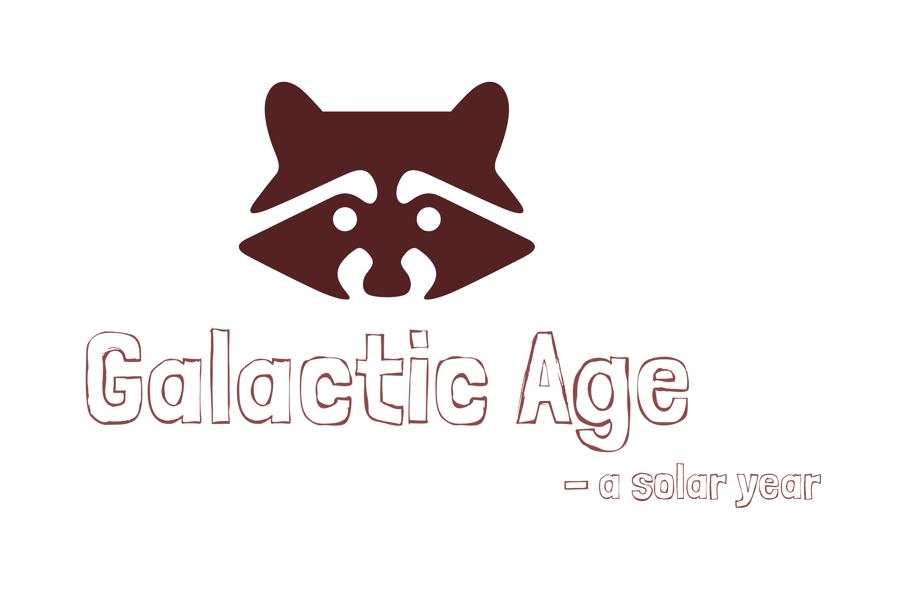

<p align="center">
  
</p>

&nbsp;&nbsp;&nbsp;&nbsp;&nbsp;&nbsp;&nbsp;&nbsp;&nbsp;&nbsp;&nbsp;&nbsp;&nbsp;
[](https://github.com/AbdulYahya/galactic-age)
&nbsp;&nbsp;&nbsp;&nbsp;&nbsp;&nbsp;
[](https://github.com/AbdulYahya/galactic-age/issues)
&nbsp;&nbsp;&nbsp;&nbsp;&nbsp;&nbsp;
[](https://github.com/AbdulYahya/galactic-age/blob/master/LICENSE)
<!-- buttons -->

## Basic Overview
A solar year lasts 365 days on planet Earth. However, the length of a solar year varies from planet to planet. For instance, a solar year on Mercury lasts 88 days. This application determines a user’s age based on a planet’s solar years.


## Install

First, clone this repo:

```sh
$ git clone https://github.com/AbdulYahya/galactic-age.git
```

From your terminal, cd into the directory you just cloned:

> :children_crossing: Path below is just an example an likely doesn't exist, unless of course you cloned into you desktop.

```sh
$ cd ~/Desktop/galactic-age
```

Install all npm and bower package:

```sh
$ npm install && bower install
```

Now, just run this gulp task:

```sh
$ gulp serve --prod
```

## Behavior Specifications
| Behavior | Input | Expected Behavior |
| :------------- | :------------- | :------------- |
| . | . | . |


## License

[MIT License][Arbitrary case-insensitive reference text]

Permission is hereby granted, free of charge, to any person obtaining a copy of this software and associated documentation files (the “Software”), to deal in the Software without restriction, including without limitation the rights to use, copy, modify, merge, publish, distribute, sublicense, and/or sell copies of the Software, and to permit persons to whom the Software is furnished to do so, subject to the following conditions:

The above copyright notice and this permission notice shall be included in all copies or substantial portions of the Software.

THE SOFTWARE IS PROVIDED “AS IS”, WITHOUT WARRANTY OF ANY KIND, EXPRESS OR IMPLIED, INCLUDING BUT NOT LIMITED TO THE WARRANTIES OF MERCHANTABILITY, FITNESS FOR A PARTICULAR PURPOSE AND NONINFRINGEMENT. IN NO EVENT SHALL THE AUTHORS OR COPYRIGHT HOLDERS BE LIABLE FOR ANY CLAIM, DAMAGES OR OTHER LIABILITY, WHETHER IN AN ACTION OF CONTRACT, TORT OR OTHERWISE, ARISING FROM, OUT OF OR IN CONNECTION WITH THE SOFTWARE OR THE USE OR OTHER DEALINGS IN THE SOFTWARE.

###### Copyright (c) 2018 Abdullah Yahya

[arbitrary case-insensitive reference text]: https://ayahya.mit-license.org
